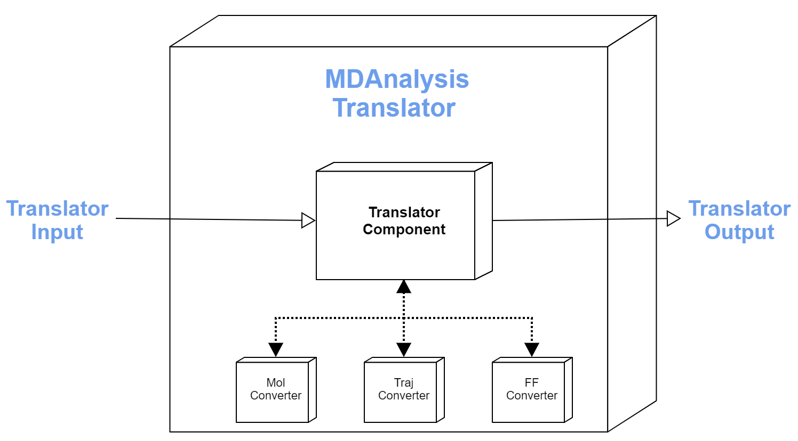

[//]: # (Badges)
[](https://github.com/MolSSI/mmic_mda/actions?query=workflow%3ACI)
[](https://codecov.io/gh/MolSSI/mmic_mda/branch/main)
[](https://lgtm.com/projects/g/MolSSI/mmic_mda/context:python)

MDAnalysis translator for MMSchema
==============================
This is part of the [MolSSI](http://molssi.org) Molecular Mechanics Interoperable Components ([MMIC](https://github.com/MolSSI/mmic)) project. This package provides translators between MMSchema and [MDAnalysis](https://github.com/MDAnalysis/mdanalysis).



# API
**mmic_mda** provides 3 classes of translators for: molecules, trajectories, and forcefields.

## Models
```python
# Import models for MDAnalysis
from mmic_mda.models import MdaMol, MdaFF, MdaTraj
 
# Create mda objects from MMSchema models
mda_mol = MdaMol.from_schema(mm_mol)
mda_ff = MdaFF.from_schema(mm_ff)
mda_traj = MdaTraj.from_schema(mm_traj)
 
# Convert mda objects to MMSchema models
mm_mol = mda_mol.to_schema()
mm_ff = mda_ff.to_schema()
mm_traj = mda_traj.to_schema()
```

## Components
```python
# Import translation input model
from mmic_translator.models import TransInput
 
# Create input for converting Mda to MMSchema molecule
from_mda = TransInput(
        tk_object = MDAnalysis.Universe,
        tk_units = mmic_mda.units
)
 
# Run conversion
mm_mol = MdaToMolComponent.compute(from_mda)
 
# Create input for converting MMSchema to Mda molecule
from_mm = TransInput(
        schema_object = MDAnalysis.Universe,
        tk_version = '>=1.0.0'
)
 
# Run conversion
mm_mol = MdaToMolComponent.compute(from_mda)
```

### Copyright
Copyright (c) 2021, MolSSI


#### Acknowledgements
 
Project based on the 
[Computational Molecular Science Python Cookiecutter](https://github.com/molssi/cookiecutter-cms) version 1.5.
